# Brute-force-personalproject4

## Overview
• In this project I simulated real world red team credential attacks by brute forcing exposed services, identifying weak/default passwords, and demonstrating how poor authentication expands the attack surface of an organization.

## Objective
• Evaluate the target for weak authentictaion controls such as default creds, anonymous login, and other misconfigurtaions to determine whether an attacker can gain initial access or a foothold on the network.

## Tools Used
• nmap
• burp suite
• dvwa
• OSINT
• Hydra

## Architecture

## Recon/ Scanning methodology
ping -c 3 (metasploitable-ip)
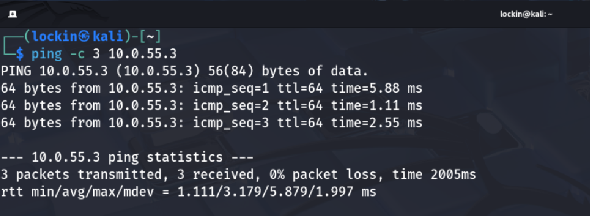
nmap -A -p 21,23,445,5432,8180
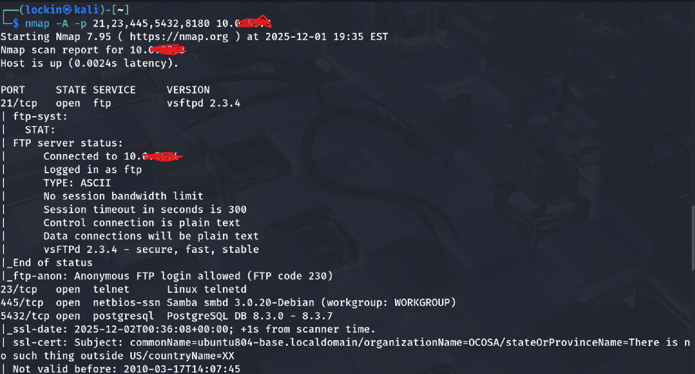
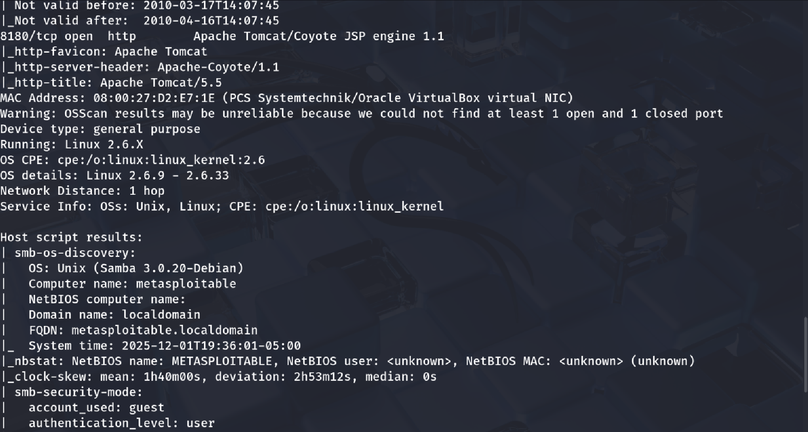
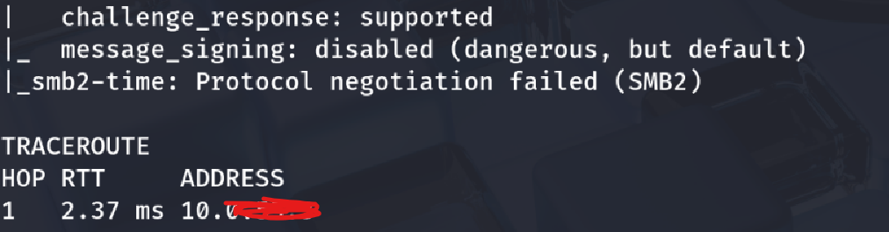

OSINT search
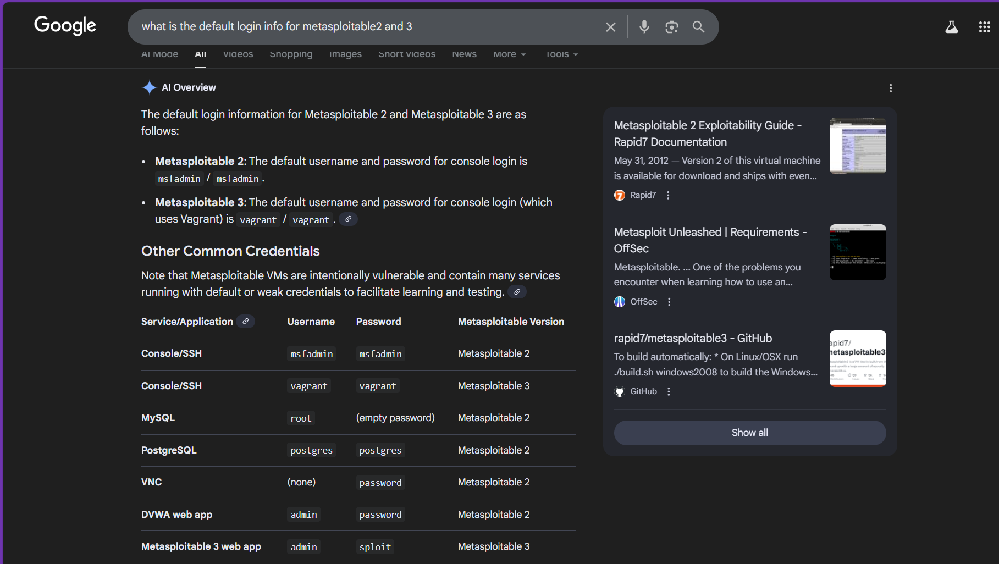

## Attack Methodogy

• Based off of the information from my nmap scans I saw that the target had a lot of vulnerabilities within it's security and I recognized a name, "Metasploitable". Metasploitable is known for having a large attack surface with weak creds being one of them. To further my search I used OSINT (Open Source Intelligence) also referred as passive recon, to search for the passwords to services in an attempt to gain access. 

• I then put together a wordlist of both possible passwords and usernames as default creds are usually the same word. (Ex: Admin:Admin) I didn't know which username would correlate to what password so I used a method refferred to as password spraying which is testing multiple passwords against each username in the wordlist provided simply put as well as every vulnerable service. I did this because it would save me time from running multiple scans and from being detected. I then began to brute force every service to see if default creds were being used

1. File Transfer Protocol (FTP)

FTP is used for file transfers but is configured with weak/default credentials most of the time. It's also vulnerable by sending credentials in cleartext and allowing anonymous access.

Syntax: hyrda -L ms3U.txt -P /usr/share/wordlists/rockyou.txt (metasploitable-ip) ftp
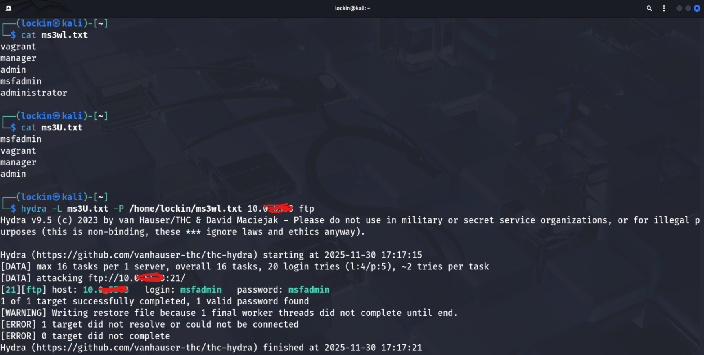

2. Telnet is an insecure command line protocol that sends data in cleartext making it a high value target for credential attacks

Syntax:
hydra -L ms3U.txt -P /usr/share/wordlists/rockyou.txt (metasploitable-ip) telnet

3. SMB is used for file shares, authentication, and remote administration. Weak smb credentials can allow lateral movement and access to resources within a network

Syntax:
hydra -L ms3U.txt -P /usr/share/wordlists/rockyou.txt (metasploitable-ip) smb

4. PostgreSQL is a database service, if compromised it can expose valuable application data or credentials stored inside the database.

Syntax:
hydra -L ms3U.txt -P /usr/share/wordlists/rockyou.txt (metasploitable-ip) postgres

5. Tomcat exposes a management panel that is most often left with weak or default credentials, I targeted the admin login panel to test whether brute forcing would give me access the management interface

Syntax:
hydra -L ms3U.txt -P /usr/share/wordlists/rockyou.txt (metasploitable-ip) 8180

## Findings

Every exposed service was configured with default credentials allowing successful authentication across the following services:
• FTP - Default username and password granted me full access to the file system
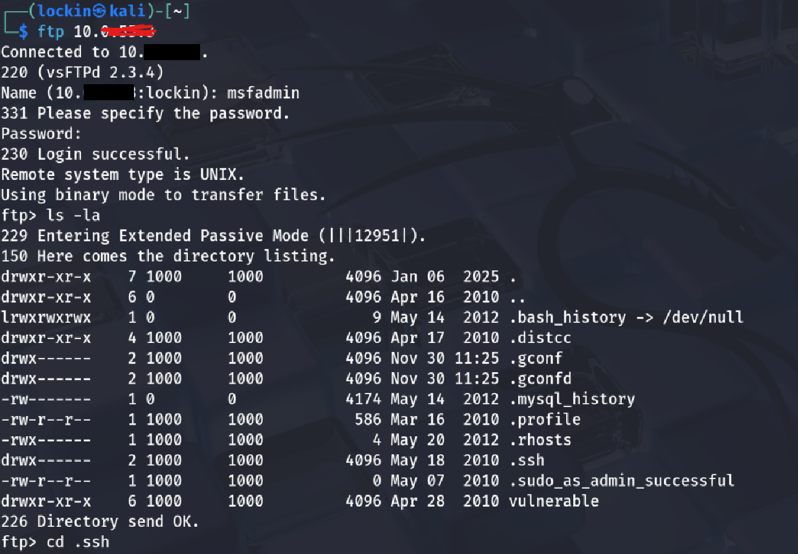
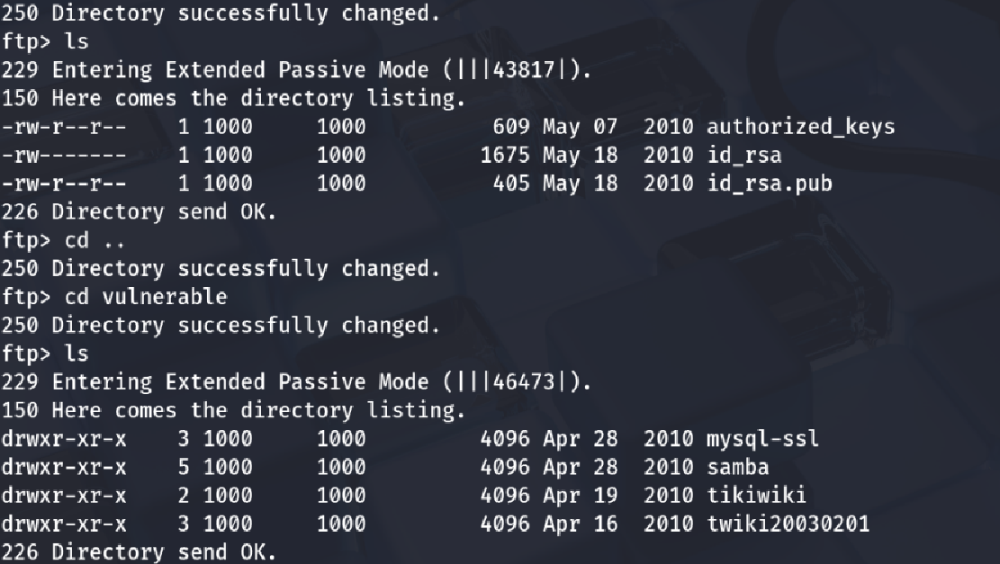
• Telnet - Weak credentials enabled remote shell access to the command line
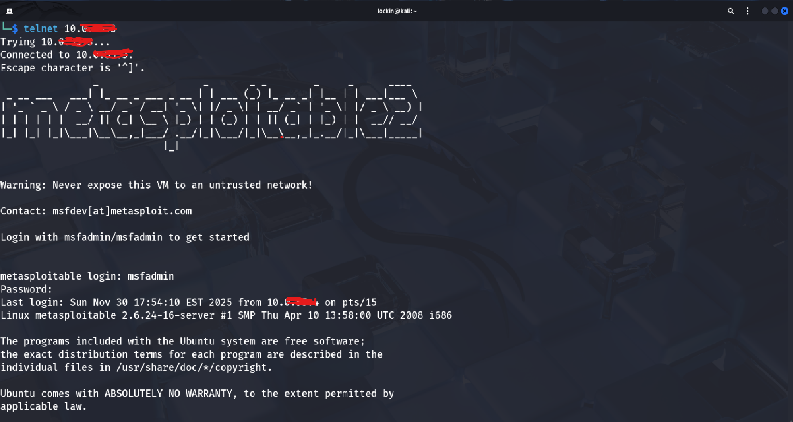
• SMB - Poor permissions gave me access to shared resources

• PostgreSQL - Weak database credentials allowed me to interact with the backend database
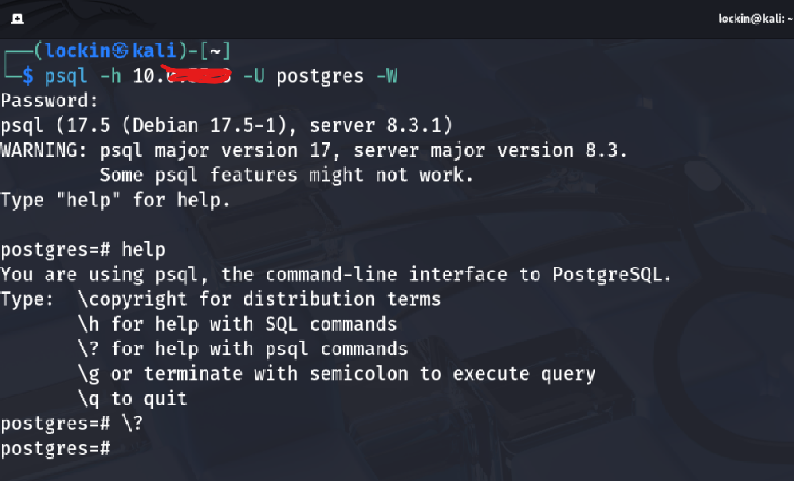

• Apache Tomcat Manager (8180) - Default login enabled me admin access to the Tomcat Manager dashboard 
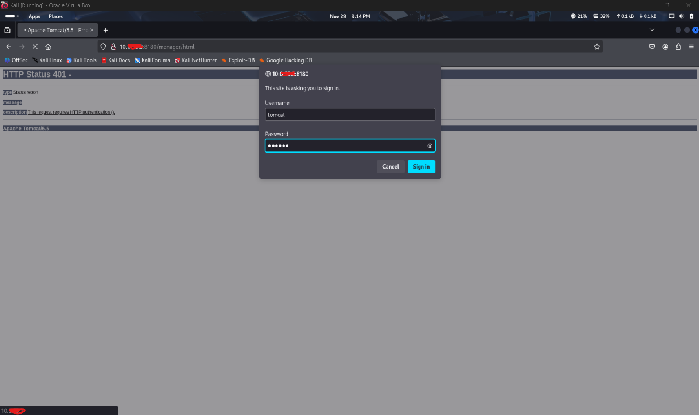
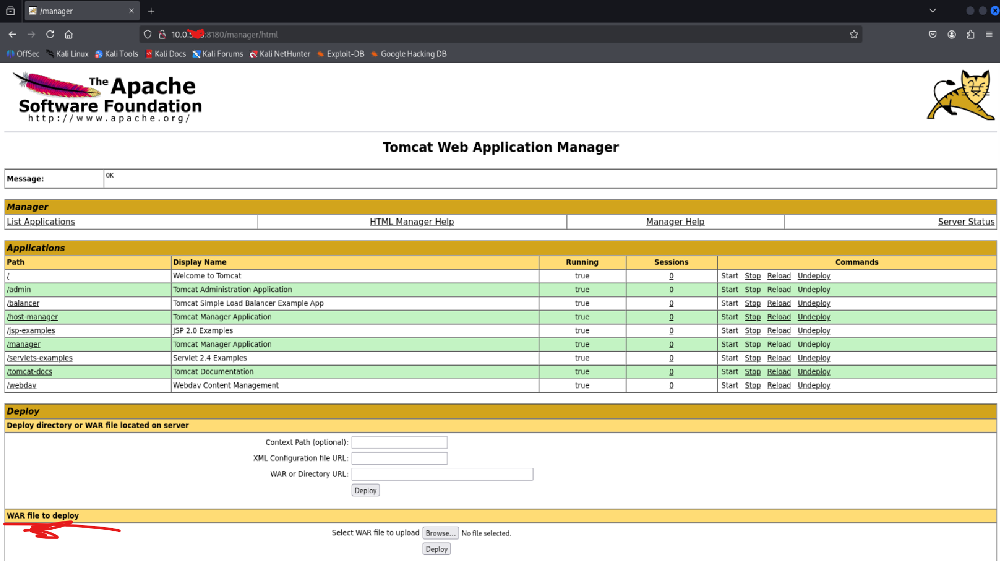

## Security Impact / Importance
• The severity of these findings are severely high as the attack surface is large. An attacker could gain initial access very easily through almost anywhere everything is poorly configured and lack the proper security meaures. 

## Recommendations
• Implement strong password policies to make gaining access to theese various services much harder decreasing the attack surface 

## Lessons Learned
• Hydra brute forcing default credentials
• Hydra http-post-form familiarity

## MITRE ATT&CK Mapping
## Conclusion

